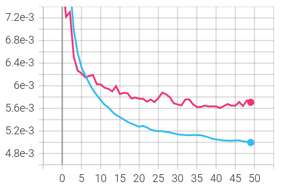
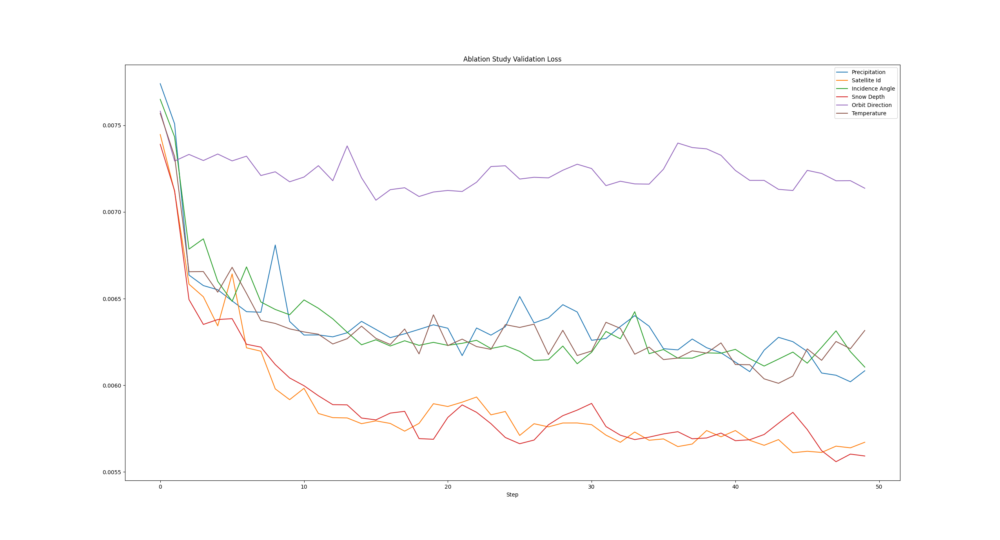

# Improved Difference Images for Change Detection Classifiers in SAR Imagery Using Deep Learning

This repository includes code for the paper **Improved Difference Images for Change Detection Classifiers in SAR Imagery Using Deep Learning**. Published in IEEE TRANSACTIONS ON GEOSCIENCE AND REMOTE SENSING, VOL. 61, 2023, [https://doi.org/10.1109/TGRS.2023.3324994](https://doi.org/10.1109/TGRS.2023.3324994) (open-access).

## Download the dataset

The dataset is downloadable from here [https://doi.org/10.23729/7b22c271-5e25-40fe-aa6a-f5d0330b1872](https://doi.org/10.23729/7b22c271-5e25-40fe-aa6a-f5d0330b1872).

## Install dependencies

```
pip install -r requirements.txt
```

## Preprocess the dataset

The dataset must be preprocessed with `preprocess_tfrecords.py` script before
training the model. Change `/path/to` in the filepaths to the actual location
where you want to store the files.

```
python preprocess_tfrecords.py --dataset_stats /path/to/stats.json --output_dir /path/to/processed/train/ input_file.tfrecord.GZIP
```

You might want to use [GNU parallel](https://www.gnu.org/software/parallel/) or similar to parallellize the processing e.g.

```
# assuming that train_files.txt includes filepaths to all files you want to preprocess
parallel --halt now,fail=1 -j 45 -I{} python preprocess_tfrecords.py --dataset_stats /path/to/stats.json --output_dir /path/to/processed/train/ {} :::: train_files.txt
```

Do same for the validation data.

```
# assuming that val_files.txt includes filepaths to all files you want to preprocess
parallel --halt now,fail=1 -j 45 -I{} python preprocess_tfrecords.py --dataset_stats /path/to/stats.json --output_dir /path/to/processed/val/ {} :::: val_files.txt
```


## Train the neural network

```
python main.py \
        --train_data "/path/to/processed/train/records/*.tfrecord.GZIP" \
        --val_data "/path/to/processed/val/records/*.tfrecord.GZIP" \
        --no_checkpoints \
        --epochs 50
```

The training script is logging the training metrics to `./logs` directory. You can see the logs with tensorboard.

```
tensorboard --logdir logs/ --samples_per_plugin "images=50"
```

Epoch loss plot with the default parameters (blue = train, red = validation):




## Computing the classifier accuracies

### Use the trained model checkpoint to add predictions to the dataset

```
python generate_change_dataset_with_predictions.py \
        --model_checkpoint "logs/CHECK_THE_CORRECT_DIR/checkpoints/final" \
        --output_dir "/path/to/simulated-change-with-prediction/" \
        "/path/to/val/records/*.tfrecord.GZIP"
```

### Compute the results

For threshold classifier:

```
python threshold_classifier.py  --save_filename minus2_5dB-shift.png --simulated_change_shift -2.5 "/path/to/simulated-change-with-prediction/*.tfrecord.GZIP"
```

And for SVC classifier:

```
python svm_classifier.py "/path/to/simulated-change-with-prediction/*.tfrecord.GZIP"
```

## Simulated change

This repository includes the `generate_change_dataset.py` script that was used
to generate the simulated change dataset for the experiments. However, the
script is too tightly coupled with the database for it to be executable
anywhere. The script requires access to the PostgreSQL database that stores the
SAR image rasters, and the database is too large to be shareable. However, you
can request the dataset that was used to run the experiments. The dataset
includes the simulated changes for the validation samples.

## Ablation Study

An ablation study was conducted for the different features to see what features
are important for the model. The experiment can be repeated using the
`--ablation_study` argument for the `main.py` script (e.g. `python main.py
--ablation_study snow_depth` trains the neural network without the snow depth
feature). The resulting validation loss plot from the different runs is
interesting, but did not fit to the paper, therefore it is presented here. The
loss clearly shows that the 'Orbit Direction' feature is the most important
one, and without it the validation loss is clearly higher than when the other
features are removed. 'Temperature', 'Precipitation', and 'Incidence Angle' are
also important features. Removing the 'Snow Depth' and 'Satellite Id' features
did not have much effect to the resulting validation loss as removing the other
features.



## Citation

```
@ARTICLE{10286479,
  author={Alatalo, Janne and Sipola, Tuomo and Rantonen, Mika},
  journal={IEEE Transactions on Geoscience and Remote Sensing}, 
  title={Improved Difference Images for Change Detection Classifiers in SAR Imagery Using Deep Learning}, 
  year={2023},
  volume={61},
  number={},
  pages={1-14},
  doi={10.1109/TGRS.2023.3324994}}
```

## Acknowledgements

This research was funded by the Regional Council of Central Finland/Council of Tampere Region and European Regional Development Fund as part of the
[*Data for Utilisation -- Leveraging digitalisation through modern artificial intelligence solutions and cybersecurity*](https://www.jamk.fi/en/research-and-development/rdi-projects/data-for-utilisation-leveraging-digitalisation-through-modern-artificial-intelligence-solutions-and) (grant number A76982),
and [*coADDVA - ADDing VAlue by Computing in Manufacturing*](https://www.jamk.fi/en/research-and-development/rdi-projects/coaddva-adding-value-by-computing-in-manufacturing) (grant number A77973) projects of Jamk University of Applied Sciences.

<p>
  
  
</p>
